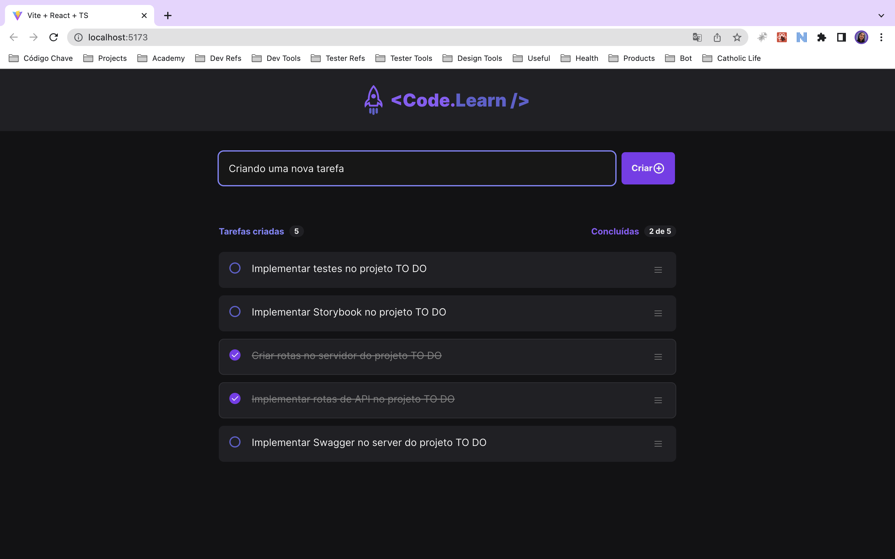
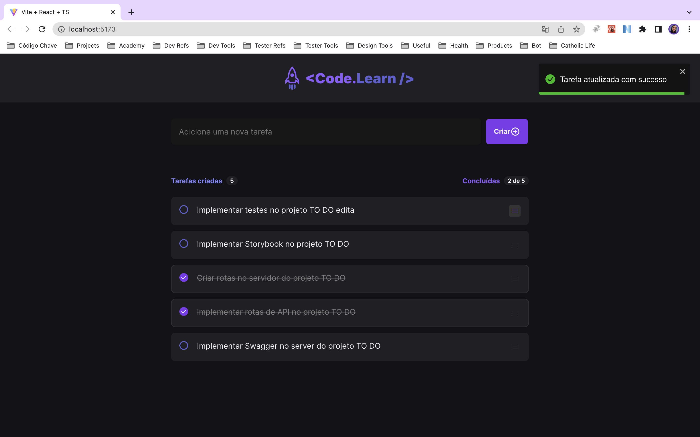
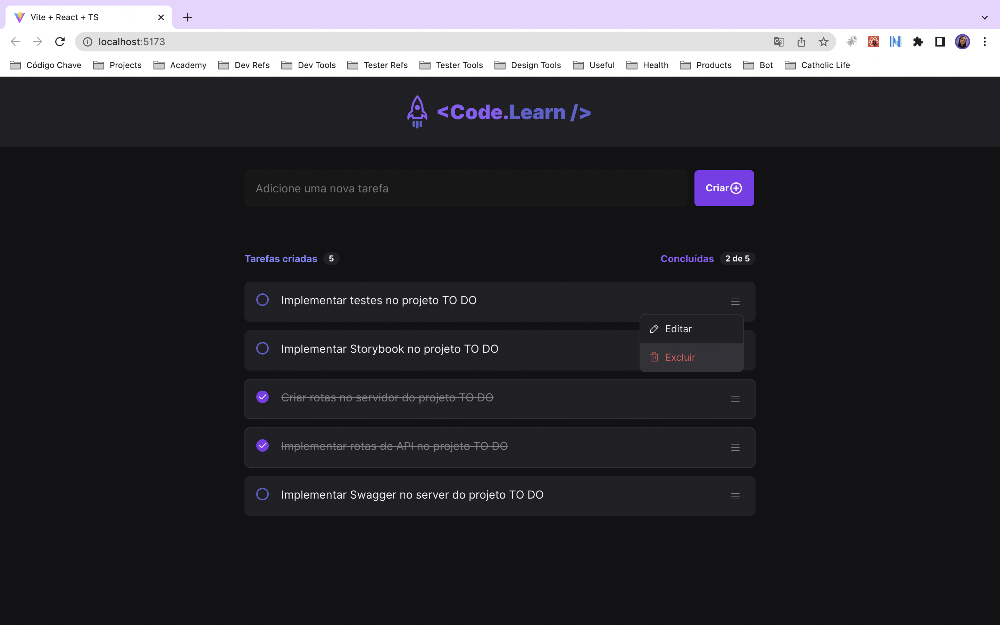
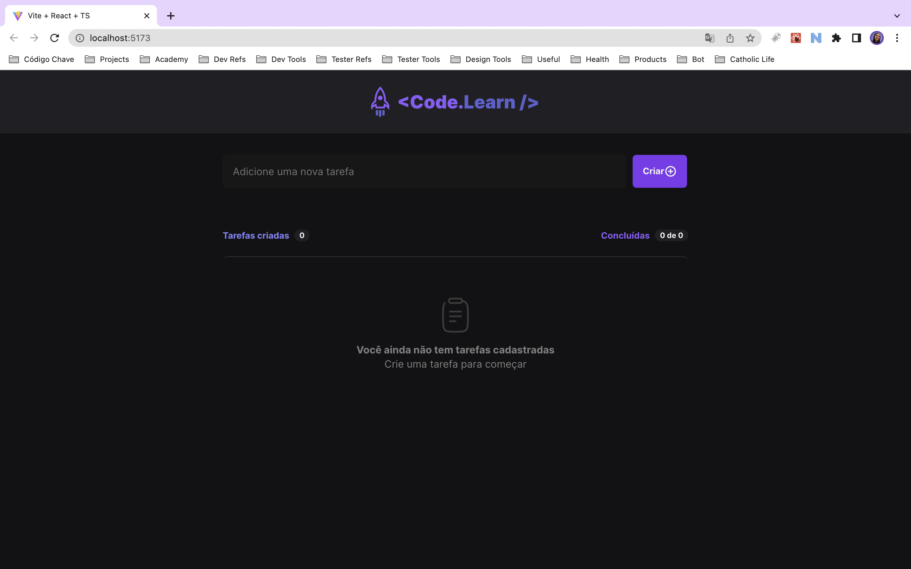

# To do list

This is a simple to do list developed with React and NodeJS. This project was developed to learn more about React and NodeJS. The project is divided into two parts: the front-end and the back-end. The front-end was developed with React and the back-end with NodeJS and Express. The front-end is available [here](https://github.com/gihoekveld/to-do-list). The back-end is available [here](https://github.com/gihoekveld/to-do-server).

## Technologies used ☕️ 🐍 ⚛️

- ReactJs
- Typescript
- Axios
- Radix UI
- Phosphor Icons
- React Toastify

## Features 📋

- Add a new task
- Mark a task as done
- Mark a task as not done
- Edit a task
- Save a task edited
- Delete a task

## Screenshots 📷

### Add a new task


### Edit a task


### Save a task edited


### Delete a task


### Show empty list



## Installation 💻

Clone the repository and install the dependencies.

```bash
git clone
cd to-do-list
npm install
```

## Usage

To run the project, use the following command:

```bash
npm run dev
```

## Project status 🚧

The project is still in development. The next steps are:

- [ ] Implement tests with Jest, React Testing Library and Cypress
- [ ] Implement a storybook documentation


